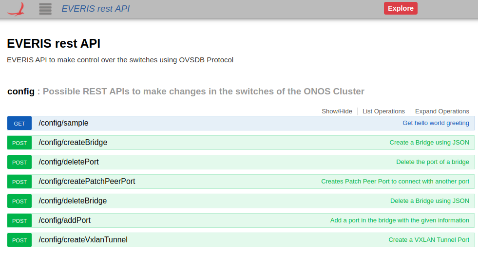
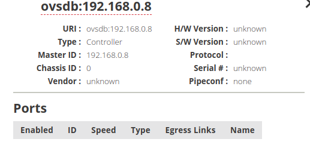

# Deployment everis.ovsdb rest

This app was created to work directly with REST API, therefore it is the **only** way to make the changes in the manager device. The Everis OVSDB REST works with the [Swagger Documentation](https://wiki.onosproject.org/display/ONOS/Generating+Swagger+documentation+for+the+REST+API) of ONOS, to make the test that we want to achieve, we are going to work directly in the Swagger Documentation of the ONOS machine were the app was uploaded. The IP address should be something like this `http://<ONOS_IP>:8181/onos/v1/docs`.



You need a device manager to work with this app. It is necessary that a OpenvSwitch system set the manager using the ONOS IP and the OVSDB port (6640). You can use the same machine as ONOS and `Mininet`, but it has its limitations, the OVS Command to to this is

```bash
# In this example the ONOS IP was 192.168.0.100
sudo ovs-vsctl set-manager tcp:192.168.0.100:6640
```

Once you have set the manager in the OVS Machine, you should see the manager in the ONOS Topology interface GUI (or onos-cli) as the next image and with a similar `deviceID`.



The swagger documentation has the JSON that you need to send to use the different POST that we have developed to manage the switches in the manager device that you have added. To create a Bridge for example the structure is shown below.

```json
{
  "ovsdb-ip": "192.168.0.8",
  "bridge-name": "br-1"
}
```

With this app in the current state you could make the next operations: 

- create a Bridge 
- delete a bridge 
- add port to a known Bridge
- delete a port to a known Bridge
- create a patch peer port
- create a VXLAN Tunnel
